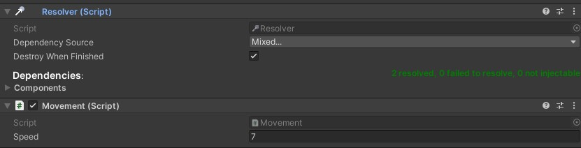
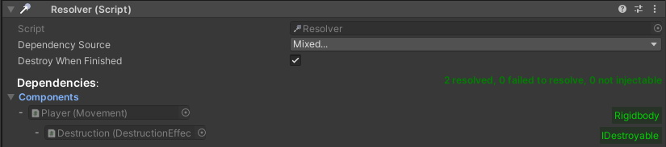

#  ![Logo][logo] Unity DI Framework 


[logo]: Packages/com.deltation.di-framework/Assets/DELTation/DIFramework/Editor/Graphics/resolver.png "Logo"

[](https://github.com/Delt06/di-framework/actions/workflows/linter.yml)

A simple Unity framework to inject dependencies into your components.

## Table of contents
- [Installation](#installation)
- [Setting Up](#setting-up)
- [Container Types](#container-types)
- [Injection Rules](#injection-rules)
- [Resolvers](#resolvers)
    - [Resolver Inspector](#resolver-inspector)
- [Rider Templates](#rider-templates)
- ["Unused" Code Stripping](#unused-code-stripping)
- [Notes](#notes)

## Installation
- Open Package Manager through Window/Package Manager
- Click "+" and choose "Add package from git URL..."
- Insert the URL: https://github.com/Delt06/di-framework.git?path=Packages/com.deltation.di-framework

## Setting up
- Create a `GameObject` and attach a `Root Dependency Container` component.
- Using the menu of the attached `Root Dependency Container` (or manually), add the other container types. For detailed info on them, refer to the section [Container types](#container-types).
- Define an injectable component according to the rules described in the section [Injection rules](#injection-rules).
- Attach the created component to a `GameObject` and add a `Resolver` to it. Configure the `Resolver`, if needed: refer to [Resolvers](#resolvers).

Example:
- Components structure: 
- `Movement.cs`: 
```c#
using UnityEngine;

public sealed class Movement : MonoBehaviour, IMovement
{
    [SerializeField, Min(0f)] private float _speed = 1f;

    public void Construct(Rigidbody rigidbody)
    {
        _rigidbody = rigidbody;
    }

    private Rigidbody _rigidbody;
}
```

## Injection rules
- General rules:
    - Value types, and `in`, `out`, `ref` parameters are not supported. 
- Normal C# classes:
    - injected through public constructors.
- `MonoBehaviour`'s:
    - injected through *ALL* public methods named `Construct`. For example:
```c#
public class Example : MonoBehaviour 
{
    public void Construct(Camera cam) 
    {
        _cam = cam;
    }

    private Camera _cam;
}
```

## Resolvers
A `Resolver` is a component that injects the dependencies of the `GameObject` (and its children) that it is attached to.  

### Resolver Inspector
The Inspector menu of the Resolver allows to specify where to get the dependencies from.  
Additionally, all the resolved/not resolved dependencies are displayed.



## Rider Templates
Useful Rider Templates (macros) can be found [here](./Macros).

## "Unused" code stripping 
- The plugin was verified to work with `Managed Stripping Level` set to `Low`.  
- A `link.xml` file in the `DI` folder root prevents the default Unity assembly (`Assembly-CSharp`) from stripping. 
- If you use assembly definitions in your code, you should create extra `link.xml` files to ensure nothing would get stripped. 
- In case of any problems related to code stripping, refer to the [official manual](https://docs.unity3d.com/Manual/ManagedCodeStripping.html).

## Notes
- Developed with Unity 2019 LTS (2019.4.17f1)
